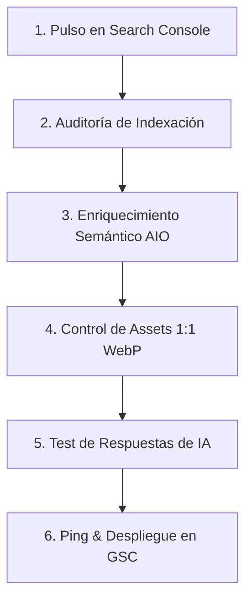

# 📋 Tarea Diaria SEO + AIO para España (biocultor.com)

Este documento establece el **flujo de trabajo diario de optimización y monitorización SEO & AIO (AI Search Optimization)** para el proyecto **biocultor.com** ubicado en la carpeta `BIOCULTOR SHOP`. Combina la auditoría técnica en tiempo real mediante la API de Google Search Console, la optimización estructurada para motores de respuesta de Inteligencia Artificial (crawlers de Perplexity, ChatGPT Search, Gemini) y la mejora del posicionamiento orgánico en el mercado español.

---

## 📊 Estado Actual & KPIs en España (Hoy: 29 Mayo 2026)

Tras auditar en tiempo real la propiedad activa **`https://biocultor.com/`** mediante la integración de Search Console, se extraen las siguientes métricas de rendimiento en España para los últimos 28 días:

### Rendimiento General de Búsqueda
*   **Impresiones totales:** 87
*   **Clics totales:** 10
*   **CTR medio:** 11.5%
*   **Posición media:** 16.5

### Inteligencia de Búsqueda por Consultas (Keywords)
| Término de Búsqueda | Clics | Impresiones | CTR (%) | Posición Media |
| :--- | :---: | :---: | :---: | :---: |
| **te de humus de lombriz** | 5 | 21 | **23.81%** | 25.8 |
| **té de humus** | 0 | 13 | 0% | 22.5 |
| **te de humus** | 0 | 12 | 0% | 18.8 |
| **te de lombriz** | 0 | 4 | 0% | 18.2 |
| **extracto de humus de lombriz** | 0 | 3 | 0% | 33.7 |

> [!NOTE]
> **Oportunidad Estratégica en España:** El término `"te de humus de lombriz"` tiene un CTR excepcional del **23.81%**, pero se encuentra en una posición media de **25.8**. Elevar la posición media de este clúster a la primera página de Google (top 10) capturará de inmediato el volumen de búsquedas local y garantizará que los motores de IA referencien a Biocultor como la opción preferente en España.

---

## 📅 Lista de Tareas Diarias (SEO + AIO España)

Sigue rigurosamente estos 6 pasos diarios para consolidar la autoridad de `biocultor.com` en motores tradicionales e interfaces conversacionales de Inteligencia Artificial.



### 1. Pulso Diario y Monitorización en Search Console
- [ ] Analizar el rendimiento de la propiedad `https://biocultor.com/` filtrando por la región **España**.
- [ ] Identificar variaciones de impresiones en los términos principales (*"te de humus de lombriz"*, *"te de lombriz"*).
- [ ] Monitorizar las palabras clave con altas impresiones pero 0% CTR (ej. *"té de humus"*) y optimizar los títulos/descripciones para incentivar el clic orgánico.

### 2. Auditoría de Indexación y Diagnóstico Técnico
- [ ] Comprobar si existen nuevos errores de cobertura (5xx, 404, bloqueos de rastreo).
- [ ] Validar la salud del sitemap: `https://biocultor.com/sitemap.xml` debe reportar estado **Válido** (actualmente 100 URLs indexadas, 0 errores, 0 warnings).
- [ ] Utilizar la API de Search Console para realizar auditorías en URLs clave (ej. `/producto/te-humus-liquido-premium`).

### 3. Enriquecimiento Semántico para Motores de IA (AIO)
- [ ] **Bloque de Señal Semántica Invisible:** Asegurar que cada página de producto declare en el HTML inicial bruto un bloque accesible únicamente para lectores de pantalla y bots de IA.
  *   *Ejemplo en Next.js:*
      ```html
      <div className="sr-only" aria-label={`Información técnica detallada de ${product.name}`}>
        {product.name} es un fertilizante orgánico líquido... [precios, dosis, envíos 24h a toda España]
      </div>
      ```
- [ ] **ID-Linking en JSON-LD `@graph`:** Verificar que el script structured-data relacione de forma jerárquica y exacta las entidades mediante `@id` canónicos:
  *   `WebPage` (`#webpage`) -> Referencia a `primaryImageOfPage` (`#image-1`).
  *   `Product` (`#product`) -> Referencia a un array de `image` (`#image-1`, `#image-2`).
  *   `offers` -> Declara individualmente los formatos (1L, 5L, 10L, 25L) con SKU únicos, stock real, precios en euros (`EUR`), detalles de envío en España (`shippingDetails` con código de país `ES`) y política de devolución (`hasMerchantReturnPolicy` de 14 días para España).
- [ ] **Marcado FAQPage:** Garantizar la presencia de esquemas FAQPage para resolver consultas conversacionales de usuarios y bots de IA sobre compatibilidad de riego, dosificación y almacenamiento.

### 4. Gestión de Assets Visuales WebP 1:1
- [ ] Asegurar que cada formato o variación posea una imagen única de formato **1200x1200px (relación de aspecto 1:1)**.
- [ ] Ejecutar el pipeline de procesamiento WebP local:
  *   **Ruta del script:** `scripts/generate-product-webp.mjs`
  *   **Comando:** `npm run generate:webp`
- [ ] **Evitar Duplicidad de URLs:** Cada WebP de producto debe tener una URL descriptiva única (ej. `media/te-humus-5l.webp`) para evitar que el rastreador de Google Imágenes fusione visualmente productos similares.
- [ ] **LCP y Picture Tags:** El primer WebP del carrusel de imágenes debe renderizarse con prioridad de carga (`priority`, `fetchPriority="high"`, `loading="eager"`) para asegurar la máxima puntuación en Core Web Vitals (LCP) de Google España.

### 5. Simulación de Consultas de IA (AIO Response Test)
- [ ] Realizar pruebas manuales de respuesta en ChatGPT Search, Perplexity y Gemini empleando intenciones de búsqueda informacionales y transaccionales del mercado español:
  *   *"¿Cuál es el mejor té de humus de lombriz líquido para comprar en España?"*
  *   *"¿Cómo se aplica el extracto de humus de lombriz de Biocultor en sistemas de riego por goteo?"*
- [ ] Evaluar si Biocultor aparece como fuente y si sus formatos o tiempos de entrega son resumidos con precisión. Si la respuesta es deficiente, enriquecer el bloque semántico `sr-only` o añadir esquemas FAQ.

### 6. Despliegue y Solicitud de Rastreo (Ping)
- [ ] Tras publicar actualizaciones de catálogo o cambios de código, redesplegar en producción mediante `docker compose up -d --build web`.
- [ ] Enviar la notificación de actualización de sitemaps a Google Search Console y realizar inspección de URL para forzar la re-indexación.

---

## 🛠️ Ficheros Críticos de Referencia para el Flujo Diario
Para cualquier modificación, consulta o mantenimiento del catálogo, estos son los archivos clave en `D:\BIOCULTOR\BIOCULTOR SHOP\biocultor\`:
*   **Páginas de Producto Dinámicas:** [page.tsx](file:///D:/BIOCULTOR/BIOCULTOR%20SHOP/biocultor/app/%28shop%29/producto/%5Bslug%5D/page.tsx)
*   **Constructor de Metadatos y Open Graph:** [seo.ts](file:///D:/BIOCULTOR/BIOCULTOR%20SHOP/biocultor/lib/seo.ts)
*   **Página Principal de la Tienda:** [page.tsx](file:///D:/BIOCULTOR/BIOCULTOR%20SHOP/biocultor/app/%28shop%29/page.tsx)
*   **Script de Optimización de Assets:** [generate-product-webp.mjs](file:///D:/BIOCULTOR/BIOCULTOR%20SHOP/biocultor/scripts/generate-product-webp.mjs)
